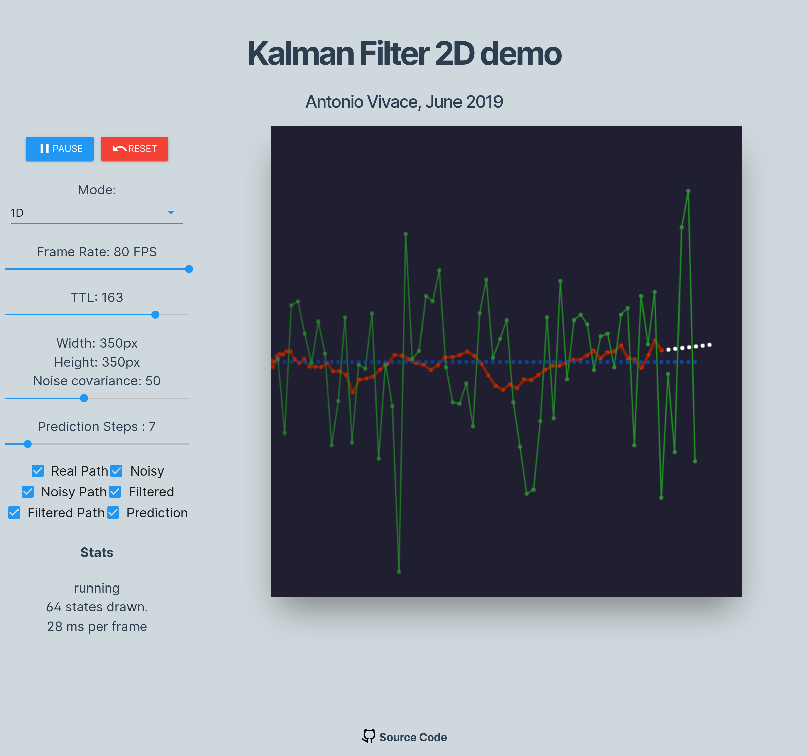
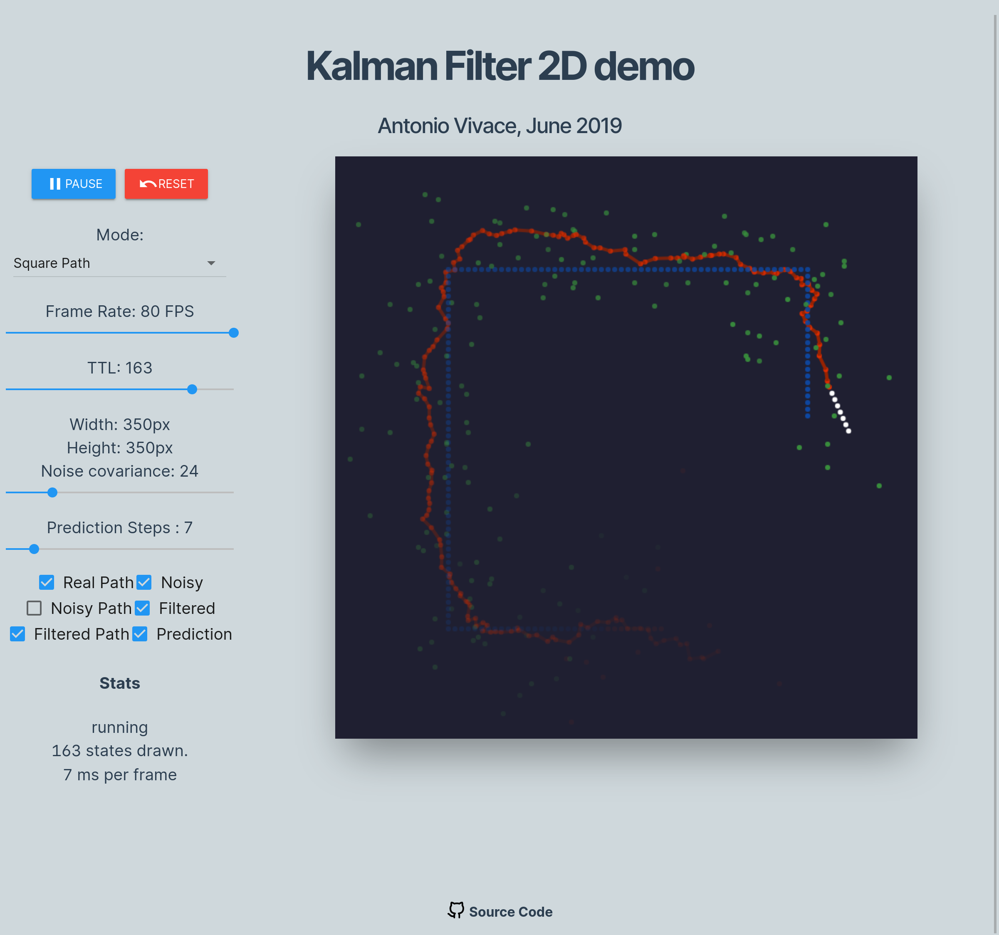

# Kalman Filter

Final project for the *Probabilistic models for decision making* course, from my MSc: *an interactive and real time 2D simulation of the Kalman Filter in use to reduce input noise*.

### [Live demo](https://avivace.github.io/kalman)

### [Slides](slides.pdf)



> The Kalman Filter is an algorithm that uses a series of measurements observed over time, containing statistical noise and other inaccuracies, and produces estimates of unknown variables that tend to be more accurate than those based on a single measurement alone, by estimating a joint probability distribution over the variables for each timeframe.
> The algorithm works in a two-step process. In the prediction step, the Kalman filter produces estimates of the current state variables, along with their uncertainties. Once the outcome of the next measurement (necessarily corrupted with some amount of error, including random noise) is observed, these estimates are updated using a weighted average, with more weight being given to estimates with higher certainty. The algorithm is recursive. It can run in real time, using only the present input measurements and the previously calculated state and its uncertainty matrix; no additional past information is required. 

Algorithm pseudocode:

```bash
m = [X, Y, deltaX, deltaY]  ← measurement vector
c = [0, 0, 0, 0]            ← control vector (not used here)

Prediction Step:
x = (A * x) + (B * c)
P = (A * P * AT) + Q        ← AT is the matrix transpose of A

Correction Step:
S = (H * P * HT) + R        ← HT is the matrix transpose of H
K = P * HT * S-1            ← S-1 is the matrix inverse of S
y = m - (H * x)
x = x + (K * y)
P = (I - (K * H)) * P       ← I is the Identity matrix


If prediction is enabled, the prediction step is looped for n 
    more frames after the above code is executed:

predX = x
predX = (A * predX) + (B * c)


The estimated position of the cursor is in the x vector:

x ← [xPos, yPos, xVel, yVel] 
```



### Deploy

```bash
git clone
npm install
npm run serve
```

Publish on `avivace.github.io/kalman`:

```bash
npm run deploy
```

> Development is done on the `develop` branch due to GitHub's restriction on branches for user pages (the build is deployed on the `master` branch and published to `avivace.github.io/kalman` from there).

### Stack

- [Vue.js](https://vuejs.org/) JS framework;
- [MuseUI](https://muse-ui.org) CSS framework;
- [Sylvester](http://sylvester.jcoglan.com/) Vector and matrix math;
- [CanvasRenderingContext2D web API](https://developer.mozilla.org/en-US/docs/Web/API/CanvasRenderingContext2D) to draw the simulation.

### References and papers

- [An introduction to the Kalman Filter](http://www.cs.utexas.edu/~pstone/Courses/393Rfall13/readings/Welch+Bishop-TR-95.pdf)
- [Implementation of Kalman Filter with Python Language](https://arxiv.org/pdf/1204.0375.pdf)
- [Understanding the Basis of the Kalman Filter via a Simple and Intuitive Derivation](https://courses.engr.illinois.edu/ece420/sp2017/UnderstandingKalmanFilter.pdf)
- [Kalman Filter Simulation](https://www.cs.utexas.edu/~teammco/misc/kalman_filter/)
- **Kalman Filtering** - Drew Bagnell
- **Applications of Kalman Filtering in Aerospace 1960 to the Present** - MOHINDER S. GREWAL and ANGUS P. ANDREWS
- **Discriminative Training of Kalman Filters** - Pieter Abbeel, Adam Coates, Michael Montemerlo, Andrew Y. Ng and Sebastian Thrun
- **Relative Study of Measurement Noise Covariance R and Process
Noise Covariance Q of the Kalman Filter in Estimation.** - Yashpal Singh, Rajesh Mehra
- **Stochastic Filtering** - Rui Castro
- Apollo Guidance System software:[Virtual AGC — AGS — LVDC — Gemini](http://www.ibiblio.org/apollo/)

### Acknowledgements

[Manuele Rota](https://github.com/dubvulture) for cleaning up some of my trash code and improving the animation logic
